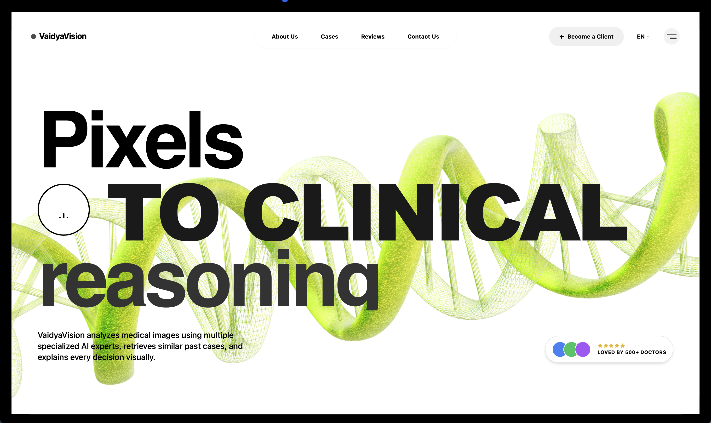
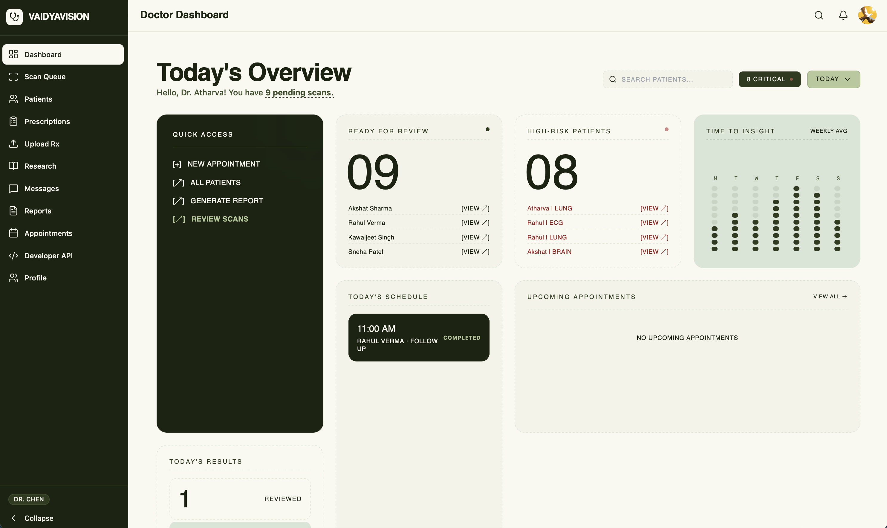
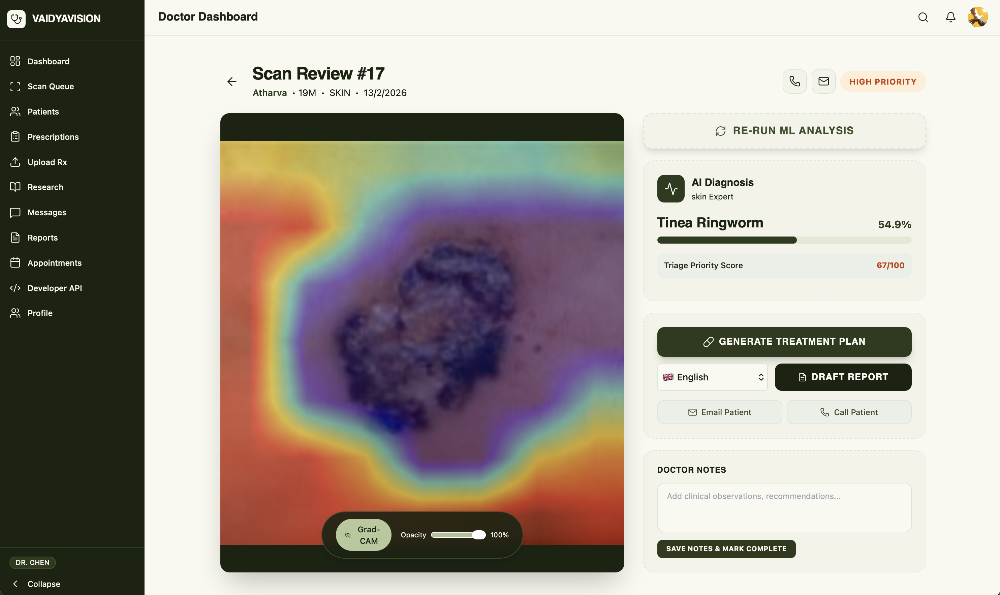
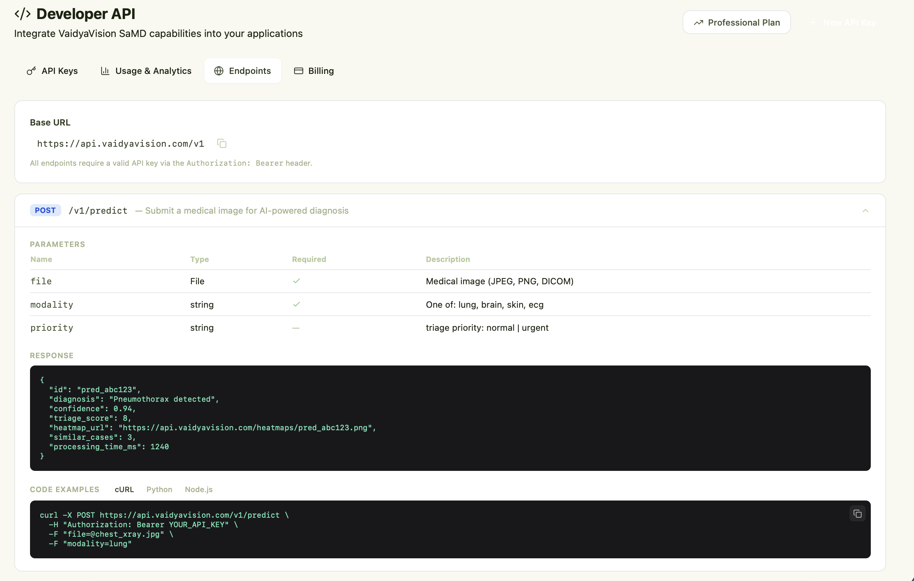
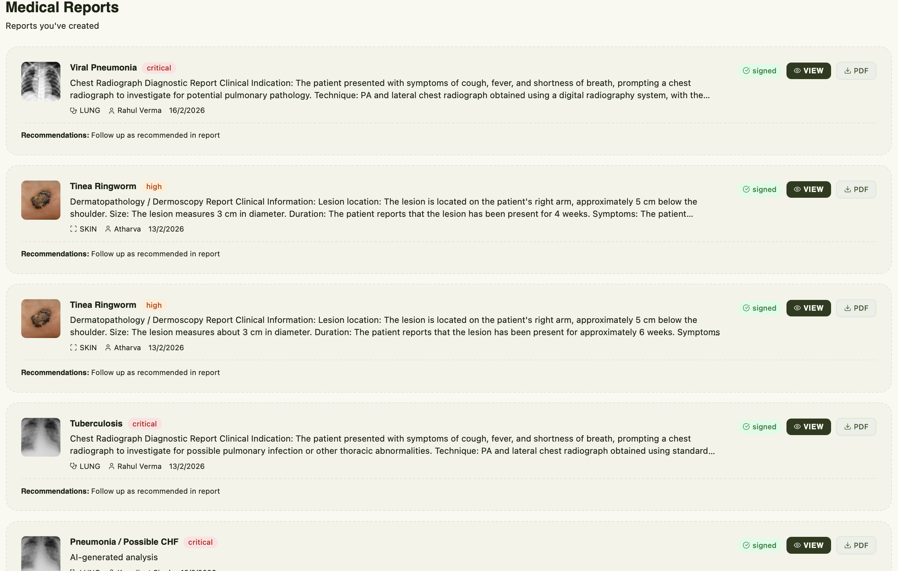
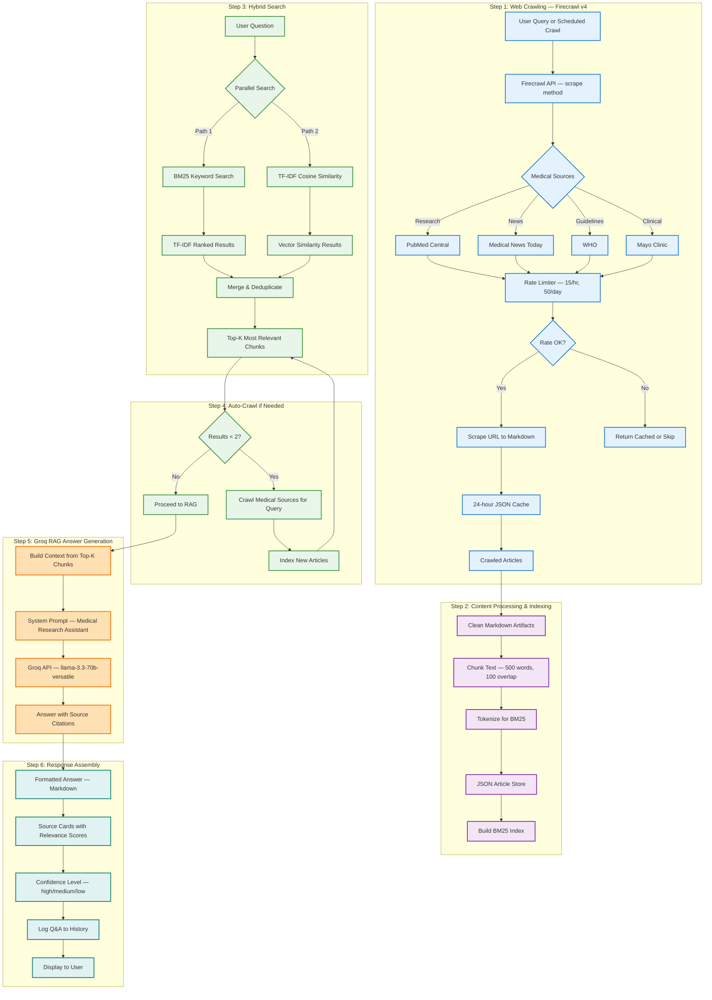

# VaidyaVision - Complete System Documentation

## 📋 Table of Contents

1. [System Overview](#system-overview)
2. [Features Implemented](#features-implemented)
3. [Architecture Diagrams](#architecture-diagrams)
4. [Technology Stack](#technology-stack)
5. [Database Schema](#database-schema)
6. [API Documentation](#api-documentation)
7. [Installation Guide](#installation-guide)
8. [Usage Examples](#usage-examples)
9. [Deployment](#deployment)

---

## 🌟 System Overview

**VaidyaVision** is an AI-powered medical diagnostic platform that combines:
- **Multi-expert ML models** for medical image analysis (Brain/Lung/Skin/ECG)
- **RAG (Retrieval-Augmented Generation)** for evidence-based diagnostics
- **OCR pipeline** for digitizing handwritten prescriptions
- **Medical research assistant** with automated web crawling
- **Predictive analytics** for patient outcomes
- **Real-time doctor-patient collaboration**


## 📸 Demo Screenshots

### 1️⃣ Landing Page


### 2️⃣ DashBoard


### 3️⃣ Structured Output


### 4️⃣ Access our APIs


### 5️⃣ OneClick Medical Reports


### 6️⃣ Medical Research Assistant

---

## ✅ Features Implemented

### **1. Core Medical Imaging Pipeline**
- ✅ Multi-expert architecture (4 specialist models: Brain, Lung, Skin, ECG)
- ✅ ModalityRouter (ResNet34) for intelligent task routing
- ✅ MC Dropout for uncertainty estimation (25 stochastic forward passes)
- ✅ GradCAM heatmap generation for explainability
- ✅ Unified single-file checkpoint (`medical_ai_system_final.pth` — 255MB)

### **2. RAG (Retrieval-Augmented Generation) System**
- ✅ Cosine similarity search for historical case matching
- ✅ Similar case retrieval with diagnosis outcomes
- ✅ Evidence-based report generation using Groq LLM
- ✅ Context-aware medical reasoning

### **3. OCR + Prescription Digitization**
- ✅ Multi-engine OCR pipeline:
  - Google Cloud Vision API (primary — handwritten + printed)
  - Multi-pass Tesseract with adaptive preprocessing (fallback)
- ✅ PDF multi-page processing (via pdf2image)
- ✅ OpenCV-based image preprocessing (upscaling, binarization, deskew)
- ✅ Groq-powered medical text cleaning (LLaMA 3.3 70B)
- ✅ Structured medication extraction (dosage, frequency, duration)
- ✅ Smart timing recommendations (e.g., "twice daily" → 9 AM, 9 PM)
- ✅ Categorized guidelines (diet, activity, lifestyle)

### **4. Medical Research Assistant**
- ✅ Firecrawl v4 integration for automated web scraping
- ✅ Multi-source crawling:
  - PubMed Central (research papers)
  - Medical News Today (health news)
  - WHO (official updates)
  - Mayo Clinic (clinical reference)
- ✅ BM25 keyword search + TF-IDF cosine similarity hybrid search
- ✅ JSON-based article store with chunking
- ✅ RAG-powered Q&A with source citations (Groq LLM)
- ✅ Rate limiting (15/hour, 50/day) with 24-hour caching
- ✅ Automatic Q&A history export

### **5. Predictive Analytics**
- ✅ Healthcare outcome prediction (XGBoost model)
- ✅ Billing amount estimation
- ✅ Risk level classification (Low/Medium/High)
- ✅ Recommended tests based on medical history
- ✅ Integration with 55k+ healthcare dataset

### **6. Authentication & User Management**
- ✅ Clerk authentication integration
- ✅ Role-based access control (Doctor, Patient, Admin)
- ✅ User profile syncing with SQLite database
- ✅ Protected route middleware

### **7. Database & Data Layer**
- ✅ SQLite + Drizzle ORM setup (WAL mode)
- ✅ Comprehensive schema (15+ tables):
  - Users, Doctor Profiles
  - Scans, Reports, Templates
  - Prescriptions, Medications, Medication Logs
  - Conversations, Messages, Notifications
  - Appointments, Follow-Ups
  - Voice Notes, Family Members
  - Exercise Routines, Exercise Logs
- ✅ Real-time updates (polling)
- ✅ Automatic timestamp management

### **8. Doctor Dashboard**
- ✅ Live statistics (pending scans, high-risk alerts)
- ✅ Scan review queue with priority sorting
- ✅ AI prediction display (diagnosis + confidence + heatmap)
- ✅ One-click report generation (Groq LLM draft)
- ✅ PDF export with letterhead (jsPDF)
- ✅ Doctor profile management
- ✅ Patient management panel
- ✅ Medical research assistant page

### **9. Patient Dashboard**
- ✅ Medical scan upload interface
- ✅ Scan history timeline
- ✅ Report viewing with download
- ✅ Status tracking (Pending/Processing/Completed)
- ✅ Doctor chat interface
- ✅ Prescription upload & OCR digitization
- ✅ Medication tracker with daily schedule & timing reminders
- ✅ Exercise tracker (routines + daily logs)
- ✅ Family member management
- ✅ Appointment booking
- ✅ Medical research assistant page
- ✅ Pill Tic-Tac-Toe mini-game (gamification on medications page)

### **10. Chat System**
- ✅ Real-time doctor-patient messaging
- ✅ AI compose assistance (Groq-powered)
- ✅ Message history persistence
- ✅ Notification system

### **11. Appointment Scheduling**
- ✅ Doctor availability management
- ✅ Weekly slot booking
- ✅ Appointment confirmation with follow-up scheduling

### **12. Demo Data**
- ✅ Pre-seeded doctor account (Dr. Atharva Deo)
- ✅ 5 demo patients (Kawaljeet, Akshat, Priya, Rahul, Sneha)
- ✅ 10+ demo scans with various modalities
- ✅ 3 critical alerts for testing

---

## 🏗️ Architecture Diagrams

### **1. End-to-End Medical Imaging + RAG Pipeline (Detailed)**

```mermaid
graph TB
    subgraph "Step 1: Image Upload & Preprocessing"
        A[Patient Uploads Medical Image]
        A --> B{Image Type?}
        B -->|DICOM| C[DICOM Parser]
        B -->|JPG/PNG| D[Standard Image Loader]
        C --> E[Resize to 224x224]
        D --> E
        E --> F[Normalize RGB - ImageNet Stats]
        F --> G[Tensor Conversion]
    end
    
    subgraph "Step 2: Modality Routing"
        G --> H[ModalityRouter - ResNet34]
        H --> I{Which Expert?}
        I -->|Brain Case| J1[Route to BrainExpert]
        I -->|Lung Case| J2[Route to LungExpert]
        I -->|Skin Case| J3[Route to SkinExpert]
        I -->|ECG Case| J4[Route to ECGExpert]
    end
    
    subgraph "Step 3: Expert Model Inference"
        J1 --> K1[BrainExpert - EfficientNetB2]
        J2 --> K2[LungExpert - DenseNet121]
        J3 --> K3[SkinExpert - ResNet50]
        J4 --> K4[ECGExpert - EfficientNetB0]
        
        K1 --> L[MC Dropout Sampling - 25 Forward Passes]
        K2 --> L
        K3 --> L
        K4 --> L
        
        L --> M[Mean Prediction]
        L --> N[Uncertainty Calculation - Std Dev]
        
        N --> O{Uncertainty > 0.15?}
        O -->|Yes| P[REJECT - Too Uncertain]
        O -->|No| Q[ACCEPT - Proceed]
    end
    
    subgraph "Step 4: Explainability - GradCAM"
        Q --> R[Backpropagate to Last Conv Layer]
        R --> S[Compute Gradient Weights]
        S --> T[Weight Feature Maps]
        T --> U[ReLU Activation]
        U --> V[Upsample to Original Size]
        V --> W[Overlay Heatmap on Image]
        W --> X[Export Heatmap PNG]
    end
    
    subgraph "Step 5: Embedding Extraction for RAG"
        Q --> Y[Extract Features from Backbone]
        Y --> Z[Embedding Head - FC Layer 2048→512]
        Z --> AA[L2 Normalization]
        AA --> AB[512-Dimensional Vector]
    end
    
    subgraph "Step 6: RAG - Similar Case Retrieval"
        AB --> AC[FAISS Vector Database]
        AC --> AD{Search Method}
        AD -->|Cosine Similarity| AE[IndexFlatIP Search]
        
        AE --> AF[Filter by Same Anatomy]
        AF --> AG[Return Top-5 Neighbors]
        
        AG --> AH[Similar Case #1 - 92% Match]
        AG --> AI[Similar Case #2 - 89% Match]
        AG --> AJ[Similar Case #3 - 87% Match]
        AG --> AK[Similar Case #4 - 85% Match]
        AG --> AL[Similar Case #5 - 82% Match]
    end
    
    subgraph "Step 7: Historical Case Metadata"
        AH --> AM1[Case ID: 8821<br/>Diagnosis: Pneumonia<br/>Outcome: Recovered in 10 days<br/>Treatment: Antibiotics]
        AI --> AM2[Case ID: 1029<br/>Diagnosis: Pneumonia<br/>Outcome: ICU admission required<br/>Treatment: IV antibiotics]
        AJ --> AM3[Case ID: 4532<br/>Diagnosis: Bacterial Infection<br/>Outcome: Full recovery<br/>Treatment: Oral antibiotics]
        AK --> AM4[Case ID: 7821<br/>Diagnosis: Viral Pneumonia<br/>Outcome: Self-limiting<br/>Treatment: Supportive care]
        AL --> AM5[Case ID: 3291<br/>Diagnosis: Aspiration Pneumonia<br/>Outcome: Resolved<br/>Treatment: Antibiotics + PT]
    end
    
    subgraph "Step 8: Context Assembly for Groq"
        Q --> AN[Current Diagnosis + Confidence]
        X --> AO[Heatmap Evidence]
        AM1 --> AP[Evidence Bundle]
        AM2 --> AP
        AM3 --> AP
        AM4 --> AP
        AM5 --> AP
        
        AN --> AP
        AO --> AP
        AP --> AQ[Patient Demographics]
        AP --> AR[Medical History]
        AP --> AS[Symptoms]
        
        AQ --> AT{Groq LLM Prompt}
        AR --> AT
        AS --> AT
    end
    
    subgraph "Step 9: Groq Report Generation"
        AT --> AU[Groq API Call - llama-3.3-70b-versatile]
        AU --> AV[System Prompt: Medical Report Writer]
        AV --> AW[Evidence-Based Reasoning]
        AW --> AX[Generate Structured Report]
        
        AX --> AY[FINDINGS Section]
        AX --> AZ[IMPRESSION Section]
        AX --> BA[RECOMMENDATIONS Section]
        
        AY --> BB[Dense consolidation in right lower lobe...<br/>Citing similar cases #8821, #1029]
        AZ --> BC[1. Bacterial Pneumonia likely<br/>2. No pleural effusion<br/>3. Recommend antibiotics]
        BA --> BD[Follow-up X-ray in 48-72 hours<br/>Blood cultures + sputum analysis]
    end
    
    subgraph "Step 10: Doctor Review & Finalization"
        BB --> BE[Display to Doctor]
        BC --> BE
        BD --> BE
        
        BE --> BF{Doctor Edits?}
        BF -->|Yes| BG[Modify Findings/Impression]
        BF -->|No| BH[Approve As-Is]
        
        BG --> BI[Final Report]
        BH --> BI
        
        BI --> BJ[Doctor Signature + Timestamp]
        BJ --> BK[Generate PDF with jsPDF]
        BK --> BL[Save to Database]
        BL --> BM[Notify Patient]
    end
    
    subgraph "Step 11: Feedback Loop - Update RAG"
        BM --> BN[Store Final Diagnosis]
        BN --> BO[Store Treatment Outcome]
        BO --> BP[Extract Embedding]
        BP --> BQ[Add to FAISS Index]
        BQ --> BR[Knowledge Base Updated]
        BR --> AC
    end
    
    classDef preprocessing fill:#e3f2fd,stroke:#1976d2,stroke-width:2px
    classDef routing fill:#fff3e0,stroke:#f57c00,stroke-width:2px
    classDef inference fill:#fce4ec,stroke:#c2185b,stroke-width:2px
    classDef explainability fill:#f3e5f5,stroke:#7b1fa2,stroke-width:2px
    classDef rag fill:#e8f5e9,stroke:#388e3c,stroke-width:2px
    classDef groq fill:#fff9c4,stroke:#f9a825,stroke-width:2px
    classDef doctor fill:#e0f2f1,stroke:#00796b,stroke-width:2px
    
    class A,B,C,D,E,F,G preprocessing
    class H,I,J1,J2,J3,J4 routing
    class K1,K2,K3,K4,L,M,N,O,P,Q inference
    class R,S,T,U,V,W,X explainability
    class Y,Z,AA,AB,AC,AD,AE,AF,AG,AH,AI,AJ,AK,AL,AM1,AM2,AM3,AM4,AM5 rag
    class AN,AO,AP,AQ,AR,AS,AT,AU,AV,AW,AX,AY,AZ,BA,BB,BC,BD groq
    class BE,BF,BG,BH,BI,BJ,BK,BL,BM,BN,BO,BP,BQ,BR doctor
```



---

### **2. Research Assistant RAG Architecture**



---

## 🛠️ Technology Stack

### **Frontend**
| Technology | Version | Purpose |
|-----------|---------|---------|
| Next.js | 14.2.x | React framework with App Router |
| React | 18.x | UI component library |
| TypeScript | 5.x | Type-safe development |
| Tailwind CSS | 3.3.0 | Utility-first styling |
| Framer Motion | 12.28.1 | Animations & transitions |
| Clerk | 6.36.9 | Authentication & user management |
| Lucide React | 0.562.0 | Icon library |
| Spline | 4.1.0 | 3D graphics for marketing page |
| jsPDF | 4.1.0 | PDF generation |
| Recharts | 3.7.0 | Data visualization |
| SWR | 2.4.0 | Data fetching & caching |
| Radix UI | latest | Accessible UI primitives |

### **Backend**
| Technology | Version | Purpose |
|-----------|---------|---------|
| Next.js API Routes | 14.2.x | REST API endpoints |
| SQLite | 3.x | Database (WAL mode) |
| better-sqlite3 | 12.6.2 | SQLite driver for Node.js |
| Drizzle ORM | 0.45.1 | Type-safe database ORM |
| FastAPI | 0.104+ | Python ML inference server |
| Uvicorn | 0.24+ | ASGI server |

### **Machine Learning**
| Technology | Version | Purpose |
|-----------|---------|---------|
| PyTorch | 2.1+ | Deep learning framework |
| torchvision | 0.16+ | Pre-trained model architectures |
| timm | 0.9.12+ | EfficientNet model zoo |
| OpenCV | 4.8+ | Image processing & heatmap overlay |
| Pillow | 10.1+ | Image loading & preprocessing |
| NumPy | 1.26+ | Numerical computing |

### **OCR Pipeline**
| Technology | Version | Purpose |
|-----------|---------|---------|
| Google Cloud Vision API | 3.5+ | Primary OCR — handwritten + printed |
| pytesseract | 0.3.10+ | Fallback OCR engine |
| pdf2image | 1.16+ | PDF to image conversion |
| OpenCV | 4.8+ | Image preprocessing (binarize, deskew) |

### **Research System**
| Technology | Version | Purpose |
|-----------|---------|---------|
| Firecrawl | v4.12+ | Web scraping (markdown extraction) |
| rank-bm25 | 0.2.2 | BM25 keyword search |
| TF-IDF | built-in | Cosine similarity fallback |
| JSON store | — | Article & chunk persistence |

### **AI/LLM**
| Technology | Version | Purpose |
|-----------|---------|---------|
| Groq API | latest | Fast LLM inference |
| LLaMA 3.3 70B Versatile | — | Report generation, OCR cleaning, research Q&A, chat |

### **Communication**
| Technology | Version | Purpose |
|-----------|---------|---------|
| Twilio | 5.12.1 | Voice & SMS reminders |
| Resend | 6.9.2 | Email notifications |
| Socket.IO | 4.8.3 | Real-time messaging |

---


---

## 📡 API Documentation

### **ML Service Endpoints (FastAPI — Port 8000)**

#### 1. **Medical Image Inference**
```bash
POST /predict
Content-Type: multipart/form-data

Body:
  file: <image_file>
  modality: "brain" | "lung" | "skin" | "ecg"  (optional — auto-routed if omitted)

Response:
{
  "status": "ACCEPTED",
  "modality": "lung",
  "diagnosis": "Bacterial Pneumonia",
  "diagnosis_index": 0,
  "confidence": 0.9412,
  "uncertainty": 0.0823,
  "triage_score": 85,
  "all_probabilities": {
    "Bacterial Pneumonia": 0.9412,
    "COVID-19": 0.0321,
    "Normal": 0.0098,
    "Tuberculosis": 0.0112,
    "Viral Pneumonia": 0.0057
  },
  "heatmap_url": "/heatmaps/heatmap_1707849321123.png"
}
```

#### 2. **OCR Text Extraction**
```bash
POST /ocr/extract
Content-Type: multipart/form-data

Body:
  file: <image_or_pdf>

Response:
{
  "status": "success",
  "raw_text": "Dr. Smith\nAmoxicillin 500mg\nTake three times daily...",
  "confidence": 0.89,
  "method_used": "google_vision",
  "document_type": "prescription"
}
```

#### 3. **Prescription Digitization (OCR + Groq)**
```bash
POST /ocr/clean-report
Content-Type: multipart/form-data

Body:
  file: <prescription_image>
  document_type: "prescription" | "lab_report" | "auto"

Response:
{
  "status": "success",
  "doctor_name": "Dr. Ramesh Patel",
  "date": "2026-02-12",
  "medications": [
    {
      "drug_name": "Amoxicillin",
      "dosage": "500mg",
      "frequency": "Three times daily",
      "duration": "7 days",
      "instructions": "Take with food",
      "form": "tablet"
    }
  ],
  "instructions": {
    "diet": ["Avoid spicy food"],
    "activity": ["Rest for 3-4 days"],
    "lifestyle": ["Avoid smoking"],
    "general": ["Monitor temperature"]
  }
}
```

#### 4. **Medication-Only Extraction**
```bash
POST /ocr/prescriptions-only
Content-Type: multipart/form-data

Body:
  file: <prescription_image>

Response:
{
  "status": "success",
  "medications": [...],
  "raw_text": "..."
}
```

#### 5. **Research Q&A (RAG)**
```bash
POST /research/ask
Content-Type: application/x-www-form-urlencoded

Body:
  query=What are the latest developments in AI for chest X-ray analysis?
  top_k=5
  crawl_if_empty=true

Response:
{
  "status": "success",
  "question": "What are the latest developments...",
  "answer": "Recent studies show AI accuracy has improved significantly...",
  "sources": [
    {
      "title": "PubMed Central - AI Radiology Research",
      "url": "https://pubmed.ncbi.nlm.nih.gov/?term=...",
      "source_name": "PubMed Central",
      "relevance_score": 0.94
    }
  ],
  "method": "hybrid_search+rag",
  "confidence": "high",
  "crawl_performed": false
}
```

#### 6. **Research Web Crawling**
```bash
POST /research/crawl-latest
Content-Type: application/x-www-form-urlencoded

Body:
  query=latest medical research breakthroughs
  max_sources=2

Response:
{
  "status": "success",
  "articles_crawled": 2,
  "index_result": {
    "indexed": 10,
    "total_chunks": 45,
    "bm25_ready": true
  },
  "rate_stats": {
    "calls_last_hour": 3,
    "calls_today": 8,
    "max_per_hour": 15,
    "max_per_day": 50,
    "can_crawl": true
  }
}
```

#### 7. **Research Stats**
```bash
GET /research/stats

Response:
{
  "status": "success",
  "index_stats": { "total_chunks": 45, "bm25_ready": true },
  "rate_stats": { "calls_last_hour": 3, "calls_today": 8, "can_crawl": true },
  "qa_count": 12
}
```

#### 8. **Export Q&A History**
```bash
GET /research/export-qa

Response:
{
  "status": "success",
  "qa_history": [...],
  "count": 12
}
```

---

### **Next.js API Routes (Port 3000)**

| Method | Endpoint | Purpose |
|--------|----------|---------|
| POST | `/api/upload` | Upload medical scan images |
| POST | `/api/ml-proxy` | Proxy to ML service `/predict` |
| POST | `/api/ai` | Groq LLM for report generation & chat |
| GET | `/api/doctor` | Doctor dashboard stats |
| GET/POST | `/api/conversations` | Chat message management |
| GET/POST | `/api/notifications` | Notification system |
| GET/POST | `/api/appointments` | Appointment scheduling |
| GET/POST | `/api/medications` | Medication tracking |
| GET/POST | `/api/exercises` | Exercise routine management |
| POST | `/api/ocr` | OCR proxy to ML service |
| POST | `/api/research` | Research Q&A proxy |
| GET | `/api/research/stats` | Research system stats |
| GET/POST | `/api/scans` | Scan management |
| GET/POST | `/api/reports` | Report management |
| POST | `/api/send-report-email` | Email report delivery |
| POST | `/api/schedule-followup` | Schedule follow-up reminders |
| POST | `/api/voice-notes` | Voice note transcription |
| GET/POST | `/api/family` | Family member management |
| GET | `/api/analytics` | Dashboard analytics |
| POST | `/api/call-reminder` | Twilio call reminders |
| POST | `/api/twiml-reminder` | TwiML for reminder flows |
| POST | `/api/twiml-confirm` | TwiML for confirmation flows |
| GET/POST | `/api/users` | User profile management |

---

## 📥 Installation Guide

### **Prerequisites**
- Node.js 18+
- Python 3.9+
- SQLite 3
- Git
- Tesseract OCR (optional — for fallback OCR)

### **Step 1: Clone Repository**
```bash
git clone https://github.com/atharvavdeo/Vaidya-Vision.git
cd Vaidya-Vision
```

### **Step 2: Frontend Setup**
```bash
cd medical-ai-platform

# Install dependencies
npm install

# Create environment file
cp .env.example .env.local

# Edit .env.local with your keys:
# NEXT_PUBLIC_CLERK_PUBLISHABLE_KEY=pk_test_...
# CLERK_SECRET_KEY=sk_test_...
# GROQ_API_KEY=gsk_...
# GOOGLE_API_KEY=...          (for OCR)
# FIRECRAWL_API_KEY=fc-...    (for research)

# Initialize database
npx drizzle-kit generate
npx drizzle-kit migrate

# Seed demo data
npm run db:seed

# Start dev server
npm run dev
# Open http://localhost:3000
```

### **Step 3: ML Service Setup**
```bash
cd ml-service

# Create virtual environment (recommended)
python3 -m venv venv
source venv/bin/activate  # Windows: venv\Scripts\activate

# Install dependencies
pip install -r requirements.txt

# Ensure the unified model checkpoint exists:
# ml-service/medical_ai_system_final.pth (255MB)

# Start ML server with API keys
GROQ_API_KEY=gsk_... \
FIRECRAWL_API_KEY=fc-... \
GOOGLE_API_KEY=... \
python server.py

# Server runs on http://localhost:8000
# API docs: http://localhost:8000/docs
```

### **Step 4: Verify Installation**
```bash
# Test ML health
curl http://localhost:8000/

# Test inference (replace with actual image)
curl -X POST http://localhost:8000/predict \
  -F "file=@test_xray.jpg" \
  -F "modality=lung"

# Test OCR
curl -X POST http://localhost:8000/ocr/extract \
  -F "file=@prescription.jpg"

# Test Research
curl -X POST http://localhost:8000/research/ask \
  -F "query=What is deep learning in medical imaging?"
```

---

## 📁 Project Structure

```
VaidyaVision/
├── README.md                          # This file
│
├── medical-ai-platform/               # Next.js 14 full-stack application
│   ├── app/                           # App Router pages
│   │   ├── layout.tsx                 # Root layout with Clerk provider
│   │   ├── globals.css                # Tailwind + custom styles
│   │   ├── not-found.tsx
│   │   │
│   │   ├── (auth)/                    # Auth pages
│   │   │   ├── login/
│   │   │   └── register/
│   │   ├── sign-in/[[...sign-in]]/    # Clerk sign-in
│   │   ├── sign-up/[[...sign-up]]/    # Clerk sign-up
│   │   ├── onboarding/page.tsx        # Role selection & profile setup
│   │   │
│   │   ├── (marketing)/              # Public landing page
│   │   │   ├── layout.tsx
│   │   │   ├── page.tsx
│   │   │   └── sections/             # Hero, Features, CTA
│   │   │
│   │   ├── dashboard/page.tsx         # Route based on user role
│   │   │
│   │   ├── doctor/                    # Doctor portal
│   │   │   ├── page.tsx               # Doctor dashboard
│   │   │   ├── layout.tsx
│   │   │   ├── queue/                 # Scan review queue
│   │   │   ├── scan/                  # Scan review workspace
│   │   │   ├── patients/              # Patient management
│   │   │   ├── reports/               # Report management
│   │   │   ├── messages/              # Doctor-patient chat
│   │   │   ├── appointments/          # Appointment management
│   │   │   ├── prescriptions/         # Prescription management + Pill TicTacToe
│   │   │   ├── research/              # Medical research assistant
│   │   │   └── profile/               # Doctor profile
│   │   │
│   │   ├── patient/                   # Patient portal
│   │   │   ├── page.tsx               # Patient dashboard
│   │   │   ├── layout.tsx
│   │   │   ├── scans/                 # Scan history
│   │   │   ├── upload/                # Scan upload
│   │   │   ├── upload-prescription/   # Prescription OCR upload
│   │   │   ├── medications/           # Medication tracker + Pill TicTacToe
│   │   │   ├── exercise/              # Exercise tracker
│   │   │   ├── reports/               # Report viewer
│   │   │   ├── messages/              # Chat with doctor
│   │   │   ├── appointments/          # Appointment booking
│   │   │   ├── family/                # Family member management
│   │   │   └── research/              # Medical research assistant
│   │   │
│   │   └── api/                       # API routes (~25 endpoints)
│   │
│   ├── components/                    # Shared UI components
│   │   ├── layout/                    # Sidebar, TopNav
│   │   ├── chat/                      # ChatView
│   │   ├── appointments/              # AppointmentView
│   │   ├── reports/                   # ReportList
│   │   ├── research/                  # ResearchPage
│   │   ├── games/                     # PillTicTacToe
│   │   ├── marketing/                 # Navbar, Footer, Spline, etc.
│   │   └── VoiceNote.tsx              # Voice note recorder
│   │
│   ├── lib/
│   │   ├── utils.ts                   # Utility functions
│   │   └── db/
│   │       ├── index.ts               # Database connection
│   │       └── schema.ts              # Drizzle ORM schema (15+ tables)
│   │
│   ├── drizzle/                       # Migration files
│   ├── scripts/                       # Seed & test scripts
│   ├── docs/                          # Documentation
│   ├── public/                        # Static assets, heatmaps, uploads
│   │
│   ├── middleware.ts                  # Clerk auth middleware
│   ├── tailwind.config.ts
│   ├── drizzle.config.ts
│   └── package.json
│
└── medical-ai-platform/ml-service/    # Python ML inference service
    ├── server.py                      # FastAPI server (all endpoints)
    ├── inference.py                   # Model loading + GradCAM + MC Dropout
    ├── model_defs.py                  # PyTorch model architectures
    ├── ocr_service.py                 # Google Vision + Tesseract OCR engine
    ├── report_cleaner.py              # Groq-powered medical text structuring
    ├── research_crawler.py            # Firecrawl web scraper + rate limiter
    ├── research_embeddings.py         # BM25 + TF-IDF hybrid search engine
    ├── research_rag.py                # Groq RAG pipeline for Q&A
    ├── iiit-pune.ipynb                # Training notebook
    ├── requirements.txt               # Python dependencies
    ├── medical_ai_system_final.pth    # Unified model checkpoint (255MB)
    ├── models/                        # Individual expert weights (legacy)
    ├── research_cache/                # Crawl cache + rate logs
    └── research_store/                # Indexed article chunks (JSON)
```

---

## 🚀 Usage Examples

### **1. Doctor Workflow**
```
1. Login → Doctor Dashboard
2. View pending scans (sorted by priority — critical first)
3. Click scan → Review AI prediction
   • Diagnosis: "Bacterial Pneumonia" — 94% confidence
   • GradCAM heatmap highlighting affected region
   • Uncertainty: 0.08 (well below 0.15 threshold)
4. Click "Generate Report" → Groq LLM creates draft
   • FINDINGS: Dense consolidation in right lower lobe...
   • IMPRESSION: 1. Bacterial Pneumonia 2. No pleural effusion
   • RECOMMENDATIONS: Broad-spectrum antibiotics, follow-up in 48-72 hours
5. Edit findings/impression if needed
6. Sign report → PDF auto-downloads with letterhead
7. Patient notified automatically
```

### **2. Patient Workflow**
```
1. Login → Patient Dashboard
2. Upload chest X-ray + describe symptoms
3. Wait for doctor review (notification sent when ready)
4. View results: diagnosis, report, download PDF
5. Upload prescription photo → OCR extracts medications
   • Drug names, dosages, frequencies extracted
   • Smart timing reminders generated (8 AM, 2 PM, 8 PM)
6. Track daily medication intake (taken/missed/skipped)
7. Log exercise routines prescribed by doctor
8. Chat with doctor if questions arise
9. Book follow-up appointment
10. Play Pill Tic-Tac-Toe while waiting! 💊
```

### **3. Research Assistant**
```
1. Navigate to Research page (both doctor & patient)
2. Ask: "What are the latest developments in AI for radiology?"
3. System:
   a. Searches indexed articles (BM25 + TF-IDF)
   b. If <2 results, auto-crawls PubMed/Medical News Today (rate-limited)
   c. Indexes new content into chunks
   d. Generates answer with Groq LLM using retrieved context
4. Returns markdown answer with cited sources
5. Source cards show title, URL, relevance score
6. Q&A saved to history for future reference
```

---

## 📈 Deployment

### **Production Deployment (Vercel + Railway)**

#### **Frontend (Vercel)**
```bash
# Install Vercel CLI
npm install -g vercel

# Deploy
cd medical-ai-platform
vercel --prod

# Set environment variables in Vercel dashboard:
# NEXT_PUBLIC_CLERK_PUBLISHABLE_KEY
# CLERK_SECRET_KEY
# GROQ_API_KEY
# GOOGLE_API_KEY
# FIRECRAWL_API_KEY
```

#### **ML Service (Railway / AWS EC2)**
```bash
# Option 1: Railway
npm install -g @railway/cli
cd ml-service
railway login && railway init && railway up

# Option 2: AWS EC2
# Launch instance, clone repo, install deps, run with systemd
```

#### **Database (SQLite → PostgreSQL for Production)**
```bash
# Update drizzle.config.ts to use PostgreSQL driver
# Update connection string in .env
npx drizzle-kit generate
npx drizzle-kit migrate
```

---

## 🔧 Model Architecture Details

### **Unified Checkpoint: `ClinicalAIDiagnosticSystem`**

All models are packaged in a single `medical_ai_system_final.pth` (255MB) containing:

| Component | Architecture | Parameters | Task |
|-----------|-------------|------------|------|
| **ModalityRouter** | ResNet34 | ~21M | Classify image → brain/lung/skin/ecg |
| **BrainExpert** | EfficientNetB2 | ~8M | 4 classes: Glioma, Meningioma, No Tumor, Pituitary |
| **LungExpert** | DenseNet121 | ~7M | 5 classes: Bacterial Pneumonia, COVID-19, Normal, TB, Viral Pneumonia |
| **SkinExpert** | ResNet50 | ~24M | 9 classes: Actinic Keratosis, Atopic Dermatitis, Benign Keratosis, Dermatofibroma, Melanocytic Nevus, Melanoma, SCC, Tinea Ringworm, Vascular Lesion |
| **ECGExpert** | EfficientNetB0 | ~4M | 4 classes: Abnormal, Infarction, Normal, History of MI |

### **Inference Pipeline**
1. **Preprocessing**: Resize 224×224, normalize (ImageNet stats), tensor conversion
2. **Routing**: ResNet34 classifies modality (or user can force modality)
3. **MC Dropout**: 25 stochastic forward passes with dropout layers in train mode
4. **Uncertainty**: Standard deviation across passes — reject if > 0.15
5. **GradCAM**: Backprop to last conv layer → gradient-weighted feature maps → JET colormap overlay
6. **Triage Score**: `confidence × 70 + (1 - uncertainty) × 30` → integer 0–100

---

## 🎯 Future Enhancements

1. **Mobile App** (React Native)
2. **Voice Dictation** for doctors (Web Speech API)
3. **3D Volumetric Imaging** (CT/MRI support)
4. **Federated Learning** (Privacy-preserving training)
5. **Multi-language Support** (Hindi, Spanish, etc.)
6. **DICOM Viewer** (Native medical imaging format)
7. **HL7 FHIR Integration** (Hospital EHR systems)
8. **Real-time Collaboration** (Multi-doctor review)
9. **Blockchain Audit Trail** (Immutable medical records)
10. **API Marketplace** for developers

---

## 📄 License

MIT License — See LICENSE file for details.
