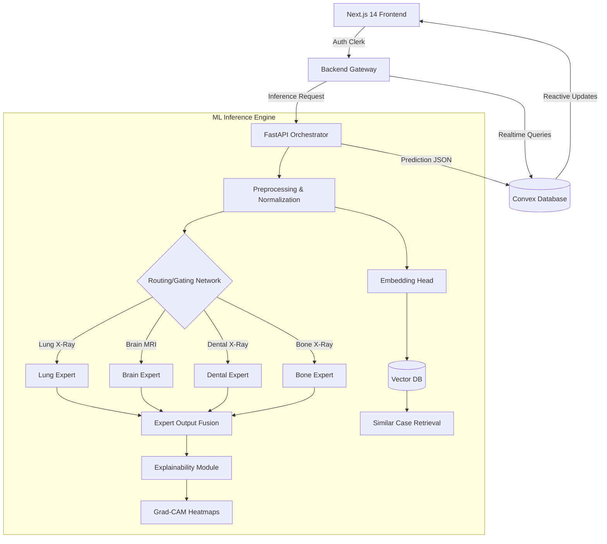
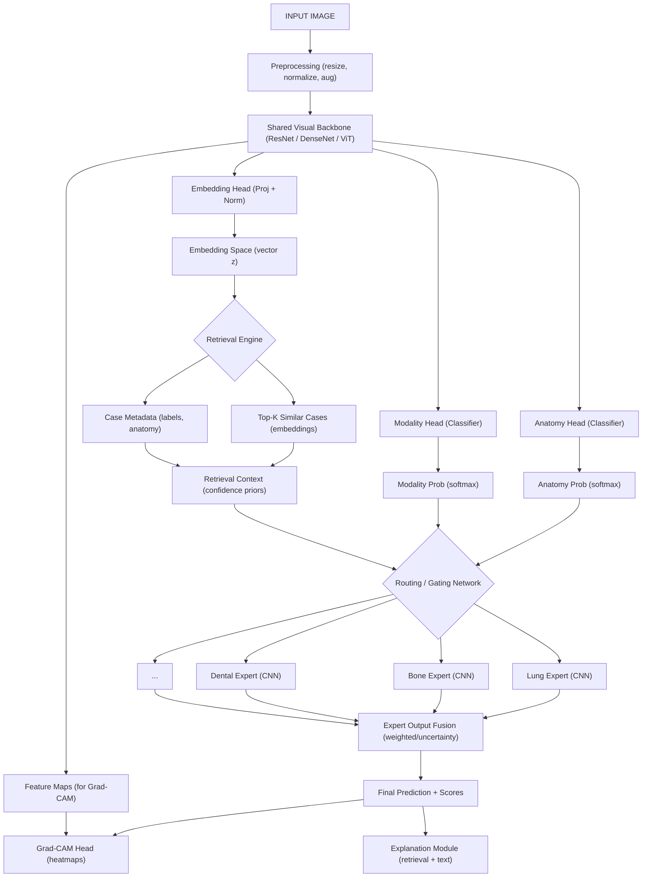

# VaidyaVision – System & Model Architecture

VaidyaVision is a medical AI diagnostics platform built to analyze medical images, route them to specialized expert models, and return **explainable, case-backed predictions** for doctors and patients.

The system is intentionally designed to decouple:
- product UX,
- real-time backend state,
- and machine learning inference.

---

## 1. High-Level System Overview

VaidyaVision is composed of four major layers:

1. **Frontend (Product Layer)**  
   User-facing dashboards for patients and doctors.

2. **Backend Orchestration Layer**  
   Coordinates inference requests and ML workflows.

3. **Real-time Data Layer**  
   Stores scans, predictions, reports, and events.

4. **ML Core (Mixture of Experts)**  
   Performs anatomy-aware, modality-aware diagnosis with explainability.

---

## 2. Technology Stack

### Frontend
- **Framework:** Next.js 14 (App Router)
- **Authentication:** Clerk
- **Styling:** Tailwind CSS
- **Visualization:** Custom React components (future: DICOM viewers)

### Backend & Data
- **Database & Realtime Engine:** Convex
- **File Storage:** Convex Storage
- **Backend Orchestration:** FastAPI (Python)

### Machine Learning
- **Framework:** PyTorch
- **Architecture:** Mixture of Experts (MoE)
- **Backbones:** ResNet, DenseNet, Vision Transformer (ViT)
- **Explainability:** Grad-CAM, LIME
- **Retrieval (RAG):** FAISS / Milvus

---

## 3. System-Level Architecture (Product + ML)

---

## 4. Detailed Model Inference Pipeline

The following flow illustrates the granular processing of an input image through the backbone, routing network, and retrieval components:

